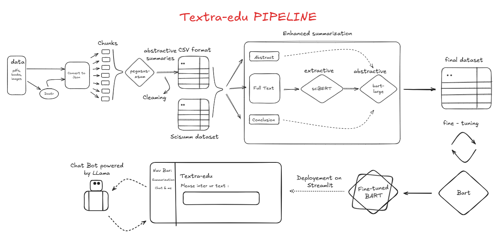

# Textra-edu: Transforming Educational Text Summarization

Textra-edu is an innovative project designed to automate the summarization of educational content, including PDFs, books, and scientific texts. By leveraging state-of-the-art tools and machine learning models, Textra-edu provides both **extractive** and **abstractive** summarization capabilities. The project ensures high-quality summaries through advanced preprocessing, summarization, and evaluation techniques, making it a valuable tool for students, researchers, and educators.

## Key Features

* **Multi-source Input:** Handles PDFs, books, and images using OCR tools like **Doctr**.
* **Structured Transformation:** Converts documents into JSON and CSV formats for downstream processing.
* **Advanced Summarization:**
    * **Extractive:** Employs **sciBERT** for scientific text extraction.
    * **Abstractive:** Utilizes models like **Pegasus** and **BART** for concise and coherent summaries.
* **Data Cleaning:** Includes regex cleaning, stopword removal, lemmatization, and similarity-based evaluation.
* **Streamlit Deployment:** Interactive chatbot integration using **Llama** for real-time user interaction.

 