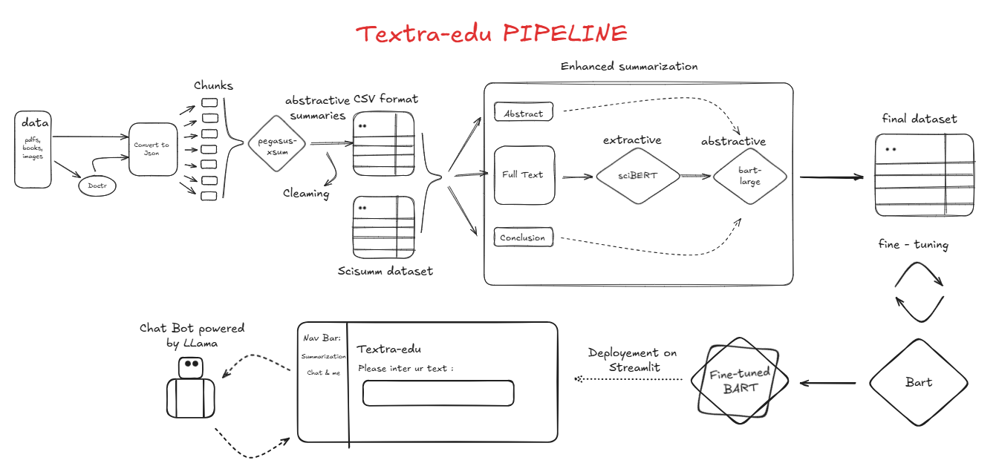
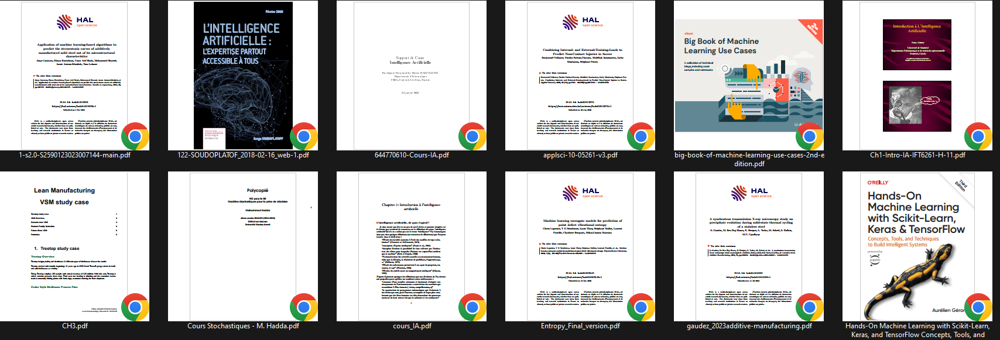
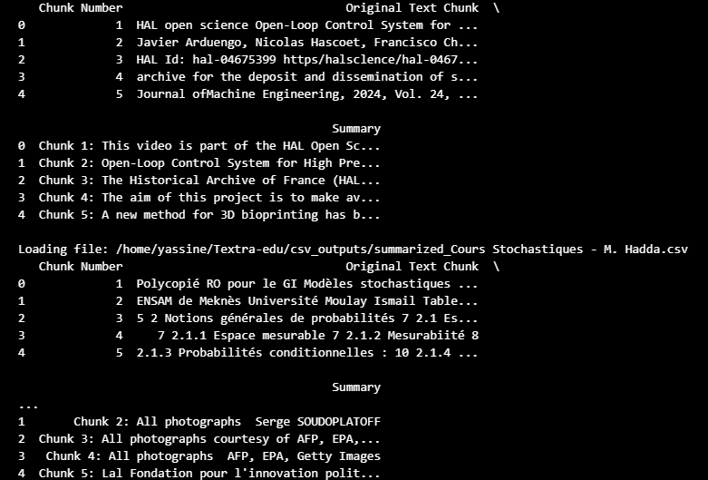
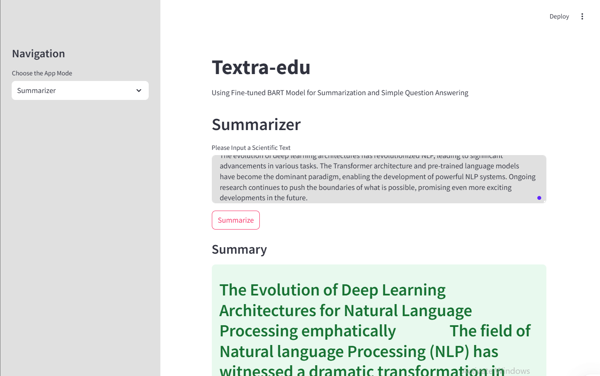
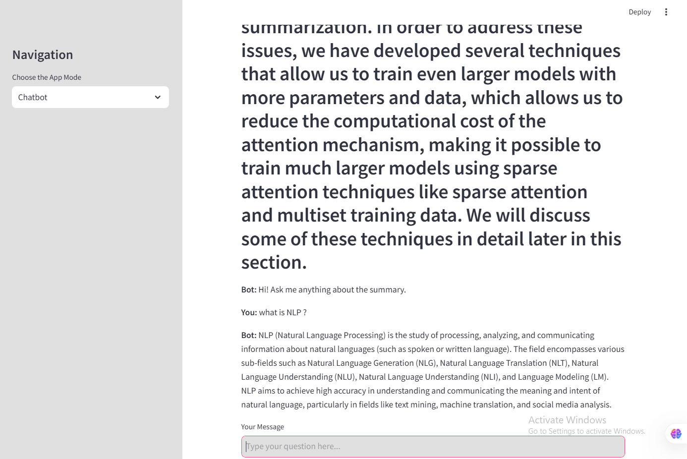

Textra-edu: Transforming Educational Text Summarization
--------------------------------------------------------

Introduction
-------------

Textra-edu is an innovative project designed to automate the summarization of educational content, including PDFs, books, and scientific texts. By leveraging state-of-the-art tools and machine learning models, Textra-edu provides both **extractive** and **abstractive** summarization capabilities. The project ensures high-quality summaries through advanced preprocessing, summarization, and evaluation techniques, making it a valuable tool for students, researchers, and educators.

**Key Features**
- **Multi-source Input**: Handles PDFs, books, and images using OCR tools like **Doctr**.
- **Structured Transformation**: Converts documents into JSON and CSV formats for downstream processing.
- **Advanced Summarization**:
  - **Extractive**: Employs **sciBERT** for scientific text extraction.
  - **Abstractive**: Utilizes models like **Pegasus** and **BART** for concise and coherent summaries.
- **Data Cleaning**: Includes regex cleaning, stopword removal, lemmatization, and similarity-based evaluation.
- **Streamlit Deployment**: Interactive chatbot integration using **Llama** for real-time user interaction.

Overview of the Pipeline
-------------------------

The Textra-edu pipeline is composed of the following steps:

1. **Data Collection**
   - Loads educational content from diverse sources, including PDFs, books, and images.
   - Uses **Doctr** to extract text and spatial information from image-based documents.

2. **Data Transformation**
   - Converts all documents into structured **JSON files** for easy processing.
   - Splits text into manageable chunks for summarization.

3. **Summarization**
   - **Pegasus Summarization**: Summarizes text chunks using `google/pegasus-xsum`.
   - Summaries are saved and further cleaned using regex, stopword removal, lemmatization, and weblink cleaning.

4. **Dataset Integration**
   - Converts cleaned JSON files to **CSV** for analysis and merges them into a single dataset.
   - Integrates external datasets, like **SciSum**, splitting them into abstract, full text, and conclusion.

5. **Evaluation Metrics**
   - Cleans and validates summaries using:
     - **Coverage Scores**: Evaluates how well summaries capture key content.
     - **Similarity Scores**: Ensures summaries remain true to the original content.
     - **Compression Ratio**: Balances summary length and content quality.

6. **Enhanced Summarization:**

   - **Extractive Summarization**: 
     - Uses **sciBERT** (a BERT model fine-tuned for scientific text) to extract the most relevant sentences.
   - **Abstractive Summarization**:
     - Combines abstract, extractive summary, and conclusion, then uses `facebook-BART-large-cnn` for high-quality abstractive summaries.

7. **Model Fine-tuning**
   - Fine-tunes the `facebook/bart-large-cnn` model on the processed dataset for enhanced summarization.

8. **Deployment**
   - Deploys the fine-tuned model on **Streamlit**.
   - Integrates a chatbot using **Llama** to allow users to ask questions about summarized content.

| 
**Why Textra-edu?**
Textra-edu simplifies the process of extracting and summarizing large volumes of educational content. With cutting-edge summarization models, robust preprocessing techniques, and a user-friendly chatbot interface, Textra-edu offers a complete solution for summarizing and interacting with educational material.

Data Collection
----------------

The first step in the Textra-edu pipeline is gathering educational content from diverse sources to ensure a comprehensive dataset. These sources include:

- **PDFs**: Digital documents containing structured and unstructured text.
- **Books**: Educational books in digital formats.
- **Images**: Scanned documents or images containing text.

To handle image-based documents, the pipeline utilizes **Doctr**, an OCR tool that extracts both text and spatial information. This ensures that even non-selectable text in images is captured and prepared for processing.

All collected content is then converted into **JSON files**, providing a structured format suitable for downstream tasks such as chunking, summarization, and evaluation.

This step ensures that Textra-edu accommodates a wide variety of educational materials, laying the foundation for robust summarization and analysis.
some of the documents used :

|
Additionally, the pipeline integrates the SciSumm dataset, a specialized collection of scientific summaries. This dataset is split into abstract, full text, and conclusion sections, which are used to enhance the summarization process with high-quality scientific content.

All collected content is then converted into JSON files, providing a structured format suitable for downstream tasks such as chunking, summarization, and evaluation.

Data Cleaning and Preprocessing
--------------------------------

After the data collection phase, Textra-edu applies a robust cleaning and preprocessing pipeline to ensure the quality, consistency, and usability of the collected dataset. This phase is critical for eliminating noise and preparing the data for summarization.

**Key Steps in Cleaning and Preprocessing:**

1. **Regex Cleaning**  
   Removes unwanted characters, symbols, and formatting artifacts from the text. This includes cleaning up line breaks, special characters, and redundant spaces.

2. **Weblink Removal**  
   Eliminates URLs and other web-related links to focus only on the textual content relevant for summarization.

3. **Stopword Removal**  
   Filters out common stopwords that do not contribute to the meaning of the text, ensuring cleaner and more meaningful inputs.

4. **Lemmatization**  
   Reduces words to their base or root forms, improving semantic consistency and enhancing the summarization process.

5. **Evaluation-Based Cleaning**  

   To refine the summaries further, evaluation metrics are integrated into the cleaning process:

   - **Coverage Scores**: Measures how well the summaries capture the key content of the original text.
   - **Similarity Scores**: Ensures that the summaries remain faithful to the source material.
   - **Compression Ratio**: Strikes a balance between summary length and information retention.

**Integration of Cleaned Data:**

- Once the cleaning process is complete, all cleaned JSON files are converted into a **CSV format** for easier analysis and downstream processing.
- The CSV files are then merged into a **single comprehensive dataset**, streamlining the integration with external datasets like **SciSumm**.
- This consolidated dataset ensures that Textra-edu operates on high-quality, preprocessed data, enabling accurate and efficient summarization.

**Final Output of Cleaning Phase:**

The cleaned dataset, now free of noise and inconsistencies, forms the foundation for advanced summarization techniques. By incorporating these preprocessing steps, Textra-edu guarantees a seamless transition from raw data to high-quality summaries, laying the groundwork for effective and meaningful text summarization.

Chunking and Initial Summarization
-----------------------------------

After cleaning and preprocessing, the next step in the Textra-edu pipeline is **chunking**, where large text bodies are divided into smaller, manageable pieces. This phase ensures that summarization models work efficiently by processing logical segments of text.

Chunking Process
~~~~~~~~~~~~~~~~~

- **Text Division**:  
  Large documents are divided into smaller chunks based on:
  
  - **Headings**: Using document structure for logical divisions.
  - **Paragraphs**: Breaking text into coherent units.
  - **Token Limits**: Splitting text into chunks of 512 tokens (or other model-specific limits) for efficient processing.

- **Preserving Context**:  
  Chunking is designed to minimize loss of context by including overlapping sentences or rephrasing transitions where necessary.

Initial Summarization
~~~~~~~~~~~~~~~~~~~~~~
The chunked text is then passed through summarization models for **preliminary summaries**:

- **Pegasus-XSum Model**:  
  Each chunk is processed using the `google/pegasus-xsum` model to generate concise and coherent summaries. This model is optimized for abstractive summarization, creating human-like text output.

- **Output Formatting**:  
  The summaries are saved in an intermediate CSV format for cleaning, further analysis, or merging with additional datasets.

Key Benefits of Chunking
~~~~~~~~~~~~~~~~~~~~~~~~~

- **Improved Model Performance**: Summarization models perform better with smaller, well-defined inputs.
- **Scalability**: Enables handling of large documents like books and lengthy research papers.
- **Modularity**: Processed chunks can be used independently or merged for broader insights.

This step lays the groundwork for advanced summarization techniques, including extractive and enhanced abstractive summarization.

Advanced Summarization
-----------------------

After generating initial summaries from individual chunks, the pipeline moves to advanced summarization techniques. This phase refines and enhances the quality of summaries through **extractive** and **abstractive** approaches, ensuring a comprehensive and coherent output.

Extractive Summarization
~~~~~~~~~~~~~~~~~~~~~~~~~

Extractive summarization focuses on identifying and selecting the most relevant sentences from the text. The pipeline utilizes **sciBERT**, a BERT model fine-tuned for scientific text processing, to achieve this:

- **Input**:  
  Processes full text, abstracts, and conclusions from datasets like **SciSum**.

- **Process**:  
  Uses sentence embeddings to evaluate the importance of each sentence based on contextual relevance.

- **Output**:  
  Generates a list of ranked sentences representing the key points of the document.

- **Benefits**:  
  - Ensures factual consistency by directly extracting text from the source.
  - Highlights the most significant content for scientific and educational use cases.

Abstractive Summarization
~~~~~~~~~~~~~~~~~~~~~~~~~~

Abstractive summarization generates summaries that paraphrase the original text, offering a concise and human-like representation of the content. The pipeline uses **BART** and **Pegasus** models for this process:

- **Input**:  
  Combines text chunks, extractive summaries, and conclusions into a unified input.

- **Process**:  
  - The `facebook/bart-large-cnn` model generates abstractive summaries.  
  - Fine-tuned versions of BART are used for improved coherence and relevance.

- **Output**:  
  Creates summaries that are shorter, more fluent, and easier to understand compared to the original text.

Enhanced Summarization Workflow
~~~~~~~~~~~~~~~~~~~~~~~~~~~~~~~

The pipeline combines the strengths of extractive and abstractive summarization to produce high-quality final outputs:

1. **Preliminary Summaries**:  
   Outputs from **sciBERT** (extractive) and **Pegasus** (abstractive) are combined.

2. **Fusion**:  
   - Integrates abstract, full text, and conclusion summaries.  
   - Focuses on retaining both breadth and depth of content.

3. **Final Output**:  
   The refined summaries are stored in a structured format (JSON or CSV) for evaluation or downstream use.

Key Advantages
~~~~~~~~~~~~~~
- **Coherence**: Produces summaries that flow naturally and maintain logical structure.
- **Flexibility**: Adaptable to various text types, including scientific articles, books, and educational materials.
- **Comprehensiveness**: Balances detail and conciseness for diverse summarization needs.

This step transforms raw text and initial summaries into polished, user-ready summaries, preparing them for deployment and evaluation.

.. _fine-tuning:

Fine-tuning the Model
-----------------------

Fine-tuning adapts a pre-trained language model, like BART, to a specific downstream task – in this case, educational text summarization. This process leverages the general language understanding already encoded in the pre-trained model, leading to faster training and better performance compared to training from scratch.

The following steps outline the fine-tuning process implemented in Textra-edu:

1. Dataset Preparation and Tokenization:
~~~~~~~~~~~~~~

*   The dataset is loaded using the ``datasets`` library, ensuring efficient handling of potentially large datasets.
*   A ``tokenize_function`` is defined to preprocess the text data for the model. This function uses the tokenizer associated with the pre-trained BART model (``facebook/bart-large-cnn``).
*   The ``tokenize_function`` performs the following operations:

    *   **Tokenization:** Converts text into numerical tokens that the model can understand.
    *   **Truncation:** Limits the input sequence length to a maximum of 1024 tokens for the full text and 128 tokens for the extractive summary to manage computational resources.
    *   **Padding:** Adds padding tokens to ensure all sequences have the same length within a batch.
    *   **Label Creation:** Assigns the tokenized extractive summaries as labels for the model to learn from.

.. code-block:: python

    from datasets import Dataset

    def tokenize_function(examples):
        model_inputs = tokenizer(
            examples["full_text"], max_length=1024, truncation=True, padding="max_length"
        )
        labels = tokenizer(
            text_target=examples["extractive_summarized_text"],
            max_length=128,
            truncation=True,
            padding="max_length"
        )
        model_inputs["labels"] = labels["input_ids"]
        return model_inputs

    tokenized_datasets = dataset.map(tokenize_function, batched=True)

2. Model Loading and Device Placement:
=======================================

*   The ``BartForConditionalGeneration`` model is loaded from the ``facebook/bart-large-cnn`` pre-trained checkpoint using the ``transformers`` library.
*   The model is moved to the available GPU (if present) for accelerated training. This significantly reduces training time.

.. code-block:: python

    from transformers import BartForConditionalGeneration
    import torch

    model = BartForConditionalGeneration.from_pretrained("facebook/bart-large-cnn")

    device = torch.device("cuda" if torch.cuda.is_available() else "cpu")
    model.to(device)

3. Training Configuration:
===========================

*   The ``TrainingArguments`` class from the ``transformers`` library is used to configure the training process. Key parameters include:

    *   ``output_dir``: Specifies the directory to save model checkpoints and training logs (e.g., ``outputs/bart-distilled-from-scibert``).
    *   ``per_device_train_batch_size``: Defines the batch size per GPU. This value should be adjusted based on available GPU memory. A smaller batch size may be necessary for larger models or limited memory.
    *   ``gradient_accumulation_steps``: Accumulates gradients over multiple steps to simulate a larger batch size. This is useful when GPU memory is limited. The effective batch size is ``per_device_train_batch_size * gradient_accumulation_steps``.
    *   ``num_train_epochs``: Sets the number of training epochs. An epoch represents one complete pass through the entire training dataset.
    *   ``learning_rate``: Controls the step size during optimization. A smaller learning rate often leads to more stable training but might require more epochs.
    *   ``weight_decay``: Applies weight decay (L2 regularization) to prevent overfitting.
    *   ``save_strategy``: Determines when to save model checkpoints. Setting it to ``"epoch"`` saves the model at the end of each epoch.
    *   ``fp16``: Enables mixed precision training (FP16) if a compatible GPU is available. This can significantly speed up training.
    *   ``push_to_hub``: Determines if the model should be pushed to the Hugging Face Model Hub.
    *   ``logging_steps``: Specifies how often to log training metrics.
    * ``evaluation_strategy``: Determines when evaluation occurs. Setting it to `"no"` skips evaluation during training. This example focuses on training, but it is highly recommended to include evaluation during training using `"epoch"` or `"steps"`.

.. code-block:: python

    from transformers import TrainingArguments, Trainer

    training_args = TrainingArguments(
        output_dir="outputs/bart-distilled-from-scibert",
        per_device_train_batch_size=2,
        gradient_accumulation_steps=8,
        num_train_epochs=2,
        learning_rate=5e-5,
        weight_decay=0.01,
        save_strategy="epoch",
        fp16=torch.cuda.is_available(),
        push_to_hub=False,
        logging_steps=50,
        evaluation_strategy="no"
    )

4. Training Execution:
~~~~~~~~~~~~~~

*   A ``Trainer`` object is instantiated, which manages the training loop. It takes the model, training arguments, and training dataset as input.
*   The training process is initiated by calling the ``trainer.train()`` method.

.. code-block:: python

    trainer = Trainer(
        model=model,
        args=training_args,
        train_dataset=tokenized_datasets,
    )

    trainer.train()

This detailed explanation provides a comprehensive overview of the fine-tuning process within Textra-edu.

.. _deployment:

Deployment
==========

This section describes the deployment of the Textra-edu application, making the summarization and chatbot functionalities accessible to users. The application is built using Streamlit, a Python framework for creating interactive web apps, and leverages the fine-tuned BART model and the Ollama API for its core functionalities.

Streamlit Application Structure
-------------------------------

The Streamlit application is structured into two main modes: Summarizer and Chatbot, selectable via a sidebar.

Summarizer Mode
~~~~~~~~~~~~~~~

*   **Text Input:** A text area allows users to input scientific text for summarization.
*   **Summarization Process:** Upon clicking the "Summarize" button, the following steps occur:

    *   The input text is tokenized using the BART tokenizer.
    *   The tokenized input is passed to the fine-tuned BART model for summary generation. Generation parameters like ``max_length``, ``min_length``, ``num_beams``, ``early_stopping``, ``repetition_penalty``, ``no_repeat_ngram_size``, ``temperature``, ``top_k``, ``top_p``, and ``do_sample`` are used to control the generation process.
    *   The generated summary is decoded back into text.
    *   Any potential errors during the process are caught and displayed to the user.
*   **Output Display:** The generated summary is displayed in a success box below the input area. The summary is also stored in the Streamlit session state for use in the Chatbot mode.

Chatbot Mode
~~~~~~~~~~~~~

*   **Summary Context:** If a summary has been generated in Summarizer mode, it is displayed as the context for the chatbot. If not, the user is prompted to summarize a text first.
*   **Chat Interface:** A chat interface is implemented using Streamlit's session state to manage the chat history. Messages from the user and the bot are displayed in a chat-like format.
*   **Ollama Integration:** User input is combined with the summary context to form a prompt for the Ollama API. The prompt is structured as follows: ``Context: {summary}\nUser Question: {user_input}\nAnswer:``.
*   **Response Generation:** The Ollama API generates a response based on the provided prompt and selected model (defaulting to "tinyllama"). The response is streamed from the API to handle potentially long responses. Error handling is included to catch JSON decoding errors and request exceptions.
*   **Output Display:** The bot's response is displayed in the chat interface.

Code Snippets
-------------

The following code snippets illustrate key parts of the deployment:

Loading the Model and Creating the Pipeline:

.. code-block:: python

    from transformers import AutoTokenizer, AutoModelForSeq2SeqLM, pipeline
    import torch

    model_path = "/home/yassine/Textra-edu/notebooks/TunedModels/bart-fine-tuned"
    bart_tokenizer = AutoTokenizer.from_pretrained(model_path)
    bart_model = AutoModelForSeq2SeqLM.from_pretrained(model_path)
    bart_pipeline = pipeline(
        "text2text-generation",
        model=bart_model,
        tokenizer=bart_tokenizer,
        device=bart_model.device,
        max_new_tokens=512,
    )

Ollama API Interaction:

.. code-block:: python

    import requests
    import json
    import streamlit as st

    def get_ollama_response(prompt, model="tinyllama"):
        try:
            url = "http://127.0.0.1:11434/api/generate"
            # ... (rest of the Ollama interaction code as provided)
        except requests.exceptions.RequestException as e:
            return f"Request Error: {e}"

Streamlit App Structure:

.. code-block:: python

    import streamlit as st
    # ... (other imports and model loading)

    st.title("Textra-edu")
    # ... (sidebar and app mode selection)

    if app_mode == "Summarizer":
        # ... (summarization logic)
    elif app_mode == "Chatbot":
        # ... (chatbot logic including Ollama integration)

Here is what it looks like :

|

|
Deployment Environment
----------------------

The application is designed to be deployed on a platform capable of running Streamlit applications. This could include:

*   **Streamlit Cloud:** A platform specifically designed for deploying Streamlit apps, offering easy deployment and sharing.
*   **Local Machine:** For development and testing, the application can be run locally using the ``streamlit run your_app.py`` command.
*   **Cloud Platforms (e.g., Google Cloud, AWS, Azure):** These platforms provide more control over the deployment environment and scalability options.

Running Ollama
--------------

The chatbot functionality relies on the Ollama API. Therefore, Ollama must be running locally or on a server accessible to the Streamlit application. Instructions for installing and running Ollama can be found in the Ollama documentation.

This detailed deployment section provides a clear overview of the application's structure, functionality, and deployment considerations.